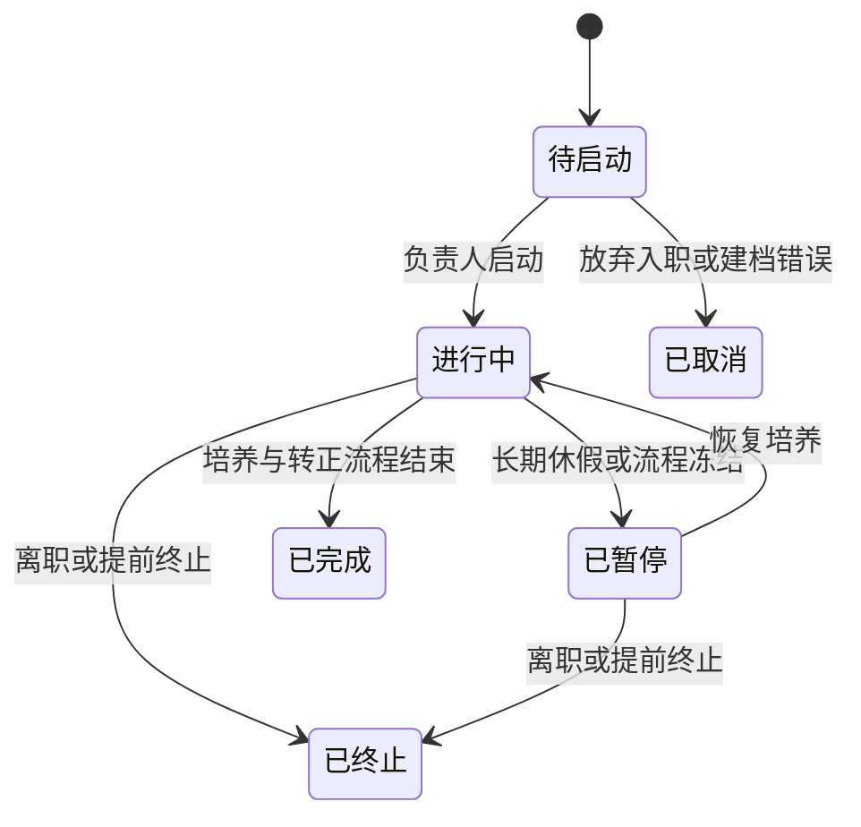
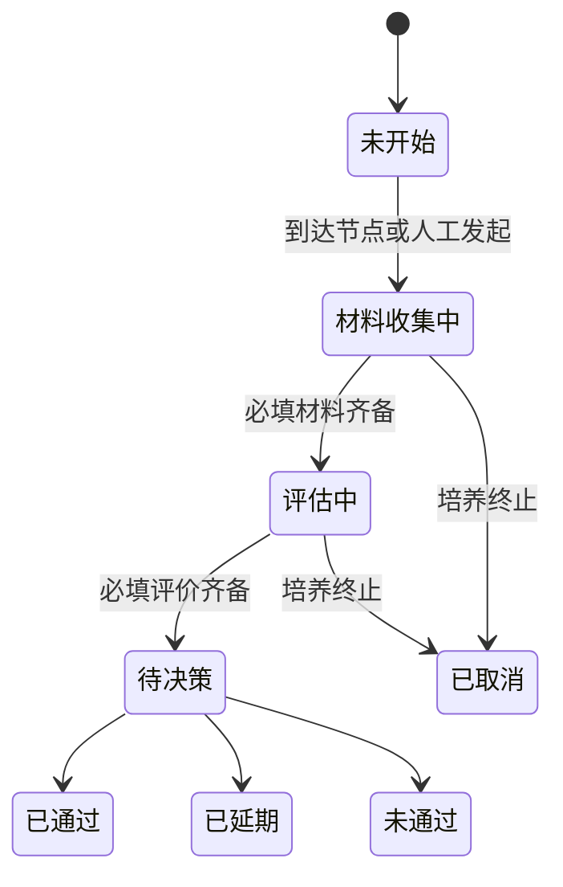

# KernelOn 新员工全生命周期管理 MVP PRD

> 状态：提案 v0.1
>
> 更新日期：2026-07-15
>
> 适用范围：KernelOn Web 首期业务闭环

## 1. 文档目的

本文定义 KernelOn 首期“新员工运作—导师带教—成长记录—转正评估”业务闭环，作为后续领域建模、API 契约、页面原型和验收用例的产品依据。

本文中的周期、提醒时间和风险阈值均为建议默认值，应支持组织级配置；标记为“待确认”的内容在进入对应功能开发前由业务负责人确认。

## 2. 背景与问题

部门的新员工信息、培养计划、导师沟通、转正材料和过程结论分散在表格、即时通信和个人文档中，导致：

- 负责人无法及时判断每位新员工当前所处阶段和下一步动作。
- 导师、新员工、直属上级对各自责任和截止时间缺少统一认知。
- 沟通结论没有形成可跟踪的行动项，风险发现依赖个人经验。
- 转正结论与培养过程脱节，历史证据难以追溯。
- 不同批次和岗位的培养经验无法复用，也无法形成可靠指标。

KernelOn 首期不是完整 HR 系统，而是部门内部的新员工培养运营系统。员工人事主数据可由负责人维护或从外部系统导入，KernelOn 负责培养过程与转正过程的事实沉淀。

## 3. 产品目标与成功标准

### 3.1 产品目标

1. **进度透明**：负责人能在一个工作台看到全部新员工的阶段、风险和下一关键节点。
2. **责任清晰**：每个任务、行动项和评估都有责任人、截止时间与完成状态。
3. **及时干预**：系统根据可解释规则发现逾期、断档和临近转正风险。
4. **过程可追溯**：导师调整、评估提交、转正决定等关键动作保留历史。
5. **经验可复用**：岗位培养计划和评估表通过版本化模板复用。

### 3.2 MVP 成功标准

- 100% 在管新员工拥有有效培养实例、负责人和试用期截止日期。
- 100% 在管新员工能够明确展示下一项待办及责任人。
- 转正流程能够覆盖通过、延期、不通过和提前终止四类结果。
- 负责人无需查阅外部表格即可识别逾期、风险和未来 30 天待转正人员。
- 任一正式转正结论均能追溯到对应评估提交和操作记录。

## 4. 范围

### 4.1 P0：MVP 必须交付

- 新员工名册、基础档案与培养实例。
- 入职/培养计划模板、实例任务和里程碑。
- 导师库、师徒分配、带教容量和调整历史。
- 定期沟通记录、导师反馈、新员工自评和行动项。
- 中期评估、转正评估、审批决定与延期复评。
- 负责人工作台、个人待办、基础提醒和风险标记。
- 角色权限、数据范围、关键操作审计。
- CSV 批量导入新员工及基础数据导出。

### 4.2 P1：MVP 稳定后交付

- 飞书、企业微信、钉钉或邮件通知集成。
- 更灵活的表单设计器和多级审批配置。
- 培训资源、成果附件、答辩日程和评委邀请。
- 部门、岗位和批次维度的分析看板。
- 外部 HR 系统和企业通讯录自动同步。

### 4.3 暂不纳入

- 招聘、Offer、合同、薪酬、考勤和正式绩效管理。
- 移动端独立应用和完整 Tauri 桌面产品交付。
- 通用工作流引擎。
- 自动转正决策、导师自动排名或基于少量样本的绩效归因。
- 面向全公司的人才盘点与长期职级晋升体系。

## 5. 核心概念

| 概念     | 定义                                                                   |
| -------- | ---------------------------------------------------------------------- |
| 组织成员 | 拥有 KernelOn 账号及组织身份的人，可承担新员工、导师、直属上级等角色。 |
| 员工档案 | 相对稳定的员工基础资料，不直接承载一次具体培养过程的状态。             |
| 培养实例 | 一名员工的一次入职、试用或专项培养过程，是业务流程的核心聚合对象。     |
| 导师分配 | 培养实例与导师在一段时间内的关系，支持更换并保留历史。                 |
| 培养计划 | 从特定模板版本生成的目标、里程碑和任务集合。                           |
| 沟通记录 | 一次正式 1v1 或阶段沟通的结构化记录。                                  |
| 行动项   | 由沟通或评估产生、具有责任人和截止日期的可跟踪事项。                   |
| 评估轮次 | 中期、转正或延期复评的一次材料收集与决策过程。                         |
| 风险记录 | 自动规则或人工判断产生的需关注事项，必须可解释、可处理、可关闭。       |

同一员工可以拥有多个历史培养实例。重新入职、转岗培养或延期复评不覆盖既有过程数据。

## 6. 角色与权限

### 6.1 角色

| 角色                    | 主要职责                                                               |
| ----------------------- | ---------------------------------------------------------------------- |
| 新员工负责人/运营负责人 | 建档、启动培养、分配导师、维护模板、处理风险、推进转正并查看全局数据。 |
| 新员工                  | 查看本人计划与待办、提交自评和材料、更新本人负责的行动项。             |
| 导师                    | 管理所带新员工计划、记录沟通、提交导师评价、上报风险。                 |
| 直属上级                | 确认培养目标、查看直属新员工过程、提交阶段与转正意见。                 |
| HR/审批人               | 核验流程完整性，记录或确认正式人事结论。                               |
| 系统管理员              | 管理账号、角色和系统配置，不因管理员身份默认获得敏感业务内容读取权。   |

一个组织成员可以同时拥有多个角色，最终权限取角色权限与数据范围的交集。

### 6.2 数据范围

| 数据           | 新员工               | 导师           | 直属上级            | 运营负责人     | HR/审批人      |
| -------------- | -------------------- | -------------- | ------------------- | -------------- | -------------- |
| 基础档案       | 本人可见，有限编辑   | 所带对象可见   | 直属对象可见        | 部门范围可管理 | 授权范围可见   |
| 培养计划/任务  | 本人可见、按责任更新 | 所带对象可管理 | 直属对象可见        | 部门范围可管理 | 默认只读       |
| 共享沟通纪要   | 本人可见并可补充自评 | 所带对象可维护 | 直属对象可见        | 部门范围可见   | 默认不可见     |
| 导师管理意见   | 不可见               | 本人提交可见   | 直属对象可见        | 部门范围可见   | 按评估流程可见 |
| 正式评估与结论 | 发布后可见           | 按评估阶段可见 | 直属对象可提交/查看 | 部门范围可管理 | 授权范围可管理 |
| 审计记录       | 默认不可见           | 默认不可见     | 默认不可见          | 业务审计可见   | 人事审计可见   |

MVP 不提供任意记录级共享配置，采用“共享纪要”和“管理意见”两个明确区域，避免用户误把敏感反馈写入新人可见内容。

## 7. 生命周期与状态

### 7.1 培养实例状态

### 7.2 评估轮次状态

延期后，在同一培养实例下创建新的复评轮次，保留原评估、原决定和延期原因，不允许覆盖原结论。

面向用户显示的“待入职、适应期、培养期、待转正、已转正、延期、未通过、已离职”等阶段标签，由培养实例、日期和评估轮次共同推导，不作为唯一业务事实字段。

## 8. 核心功能需求

### 8.1 新员工档案与培养实例

必填字段：姓名、工号、组织/团队、岗位、入职日期、试用期截止日期、直属上级、运营负责人。

选填字段：办公地点、联系方式、员工类型、批次、个人简介、技能标签、备注。

业务规则：

- 工号在组织内唯一；尚无工号时允许使用临时标识，正式启动前必须补齐。
- 入职日期或试用期截止日期变更时，系统展示对现有任务和提醒的影响，由负责人确认是否重排。
- 新员工账号未开通时允许负责人预建档案；账号开通后再绑定组织成员。
- 培养实例启动前必须存在负责人、直属上级、有效培养计划和试用期截止日期。

### 8.2 培养计划与任务

模板至少按组织、岗位族和试用期长度配置，并具有版本号、生效状态和创建时间。

任务字段：标题、说明、阶段、责任人角色、验收人角色、计划开始日、截止日、完成标准、状态、完成说明和证据链接。

任务状态：未开始、进行中、待验收、已完成、已取消。

业务规则：

- 培养实例始终引用启动时的模板版本；模板升级不自动修改运行中的实例。
- 负责人可以基于模板调整单个实例，但变更必须留痕。
- 任务完成不等于验收通过；配置了验收人的任务必须经过验收。
- 取消任务必须填写原因，取消项不计入计划完成率。

### 8.3 导师管理

导师字段：组织成员、可带教岗位/技能、最大并发人数、当前有效带教数、可用状态和备注。

导师分配字段：培养实例、导师、开始日期、结束日期、分配原因、调整原因和操作人。

业务规则：

- 默认只允许一名主导师；协同导师作为 P1 能力。
- 超过最大并发人数时不阻止负责人分配，但必须二次确认并产生负载提醒。
- 更换导师不会转移历史记录的作者身份；新导师只能按权限读取历史内容。
- 导师离开组织或失效时，其有效分配必须进入待处理队列。

### 8.4 沟通记录与行动项

沟通记录字段：沟通时间、沟通类型、主题、共享纪要、新员工自评、导师管理意见、当前状态判断、支持诉求、参与人和下次计划沟通日。

行动项字段：标题、来源、责任人、截止日期、状态、完成说明和关闭人。

行动项状态：待处理、进行中、已完成、已取消。

业务规则：

- 沟通记录保存草稿后仅作者可见，提交后进入正式记录；提交后修改需保留版本与修改原因。
- 正式沟通记录必须包含共享纪要或至少一个行动项。
- 未完成行动项在下一次沟通页中自动展示，不能因创建新沟通记录而丢失。
- 新员工只能编辑自己的自评和本人负责的行动项，不能修改导师意见。

### 8.5 评估与转正

评估轮次包含：类型、计划日期、评估表模板版本、必填提交人、提交状态、综合结论、决定人、决定日期和决定说明。

MVP 支持三类评估：中期评估、转正评估、延期复评。

业务规则：

- 正式评估至少包含新员工自评、导师评价和直属上级评价；组织可配置 HR 是否必填。
- 提交人只能修改自己的草稿；正式提交后如需退回，由负责人填写原因并重新开放。
- 必填评价未齐备时不能进入待决策。
- 决定必须包含结果和说明；延期还必须包含新的截止日期及改进要求。
- 结果发布前，新员工不可见其他评价人的未发布意见。
- 已作出的正式决定不可直接编辑，只能通过有审计记录的更正操作处理录入错误。

### 8.6 待办、提醒与风险

待办来源包括任务、行动项、沟通计划、评估提交、评估决策和风险处理。

建议默认提醒规则：

- 截止前 7 天、3 天和当天提醒责任人。
- 逾期后提醒责任人；逾期 3 天仍未处理时同步提醒负责人。
- 试用期截止前 21 天仍无转正评估轮次时，自动创建高优先级风险。
- 距上次正式沟通超过 14 天时提醒导师；超过 21 天时创建风险。
- 导师失效、必填责任人缺失或培养实例无有效计划时立即创建高优先级风险。

风险字段：来源、级别、规则说明、证据、责任人、状态、处理说明、创建时间和关闭时间。

风险状态：待处理、处理中、已关闭、已忽略。忽略风险必须填写原因；自动风险在触发条件消失后可以建议关闭，但不自动删除历史。

### 8.7 导入、导出与审计

- CSV 导入必须提供字段映射预览、逐行校验和错误报告；存在错误时不得静默跳过。
- 导出遵循当前用户的数据范围和字段权限。
- 关键审计事件包括：培养实例启动/终止、导师调整、模板实例化、正式记录修改、评估提交/退回、转正决定及更正、敏感字段导出。

## 9. 页面与信息架构

### 9.1 负责人工作台

- 指标摘要：在管人数、未来 30 天待转正、逾期事项、未关闭风险。
- 今日/本周待办。
- 风险新员工列表，按级别和时间排序。
- 新员工阶段分布和快速筛选。
- 快捷动作：新建档案、批量导入、分配导师、发起评估。

### 9.2 新员工名册

- 支持按团队、岗位、批次、阶段、负责人、导师和风险筛选。
- 默认列：姓名、岗位、入职日期、当前阶段、导师、计划完成度、下一节点、风险。
- 支持保存视图与导出；保存视图可后置到 P1。

### 9.3 新员工详情

统一承载一次培养实例的完整上下文：

- 概览：身份、阶段、关键日期、导师、风险和下一动作。
- 培养计划：里程碑、任务和完成证据。
- 沟通与行动：时间线、未完成行动项和新增沟通入口。
- 评估与转正：评估轮次、材料状态和正式结论。
- 变更记录：导师调整、日期变更和关键审计事件。

### 9.4 导师工作台

- 当前带教对象及下一关键节点。
- 待沟通、待评价、逾期行动项。
- 带教容量与历史带教记录。

### 9.5 我的成长

- 本人阶段、关键日期和下一步。
- 培养任务与行动项。
- 自评、沟通记录和支持诉求入口。
- 已发布的评估与转正结果。

## 10. 关键用户故事与验收标准

### US-01 负责人创建并启动培养实例

**作为**新员工负责人，**我希望**从模板创建培养实例，**以便**新员工入职时已有明确计划。

验收标准：

- 缺少必填字段或有效计划时不能启动，并明确指出缺失项。
- 启动后按模板生成任务、责任人和截止日期。
- 新员工、导师和直属上级分别看到属于自己的待办。
- 系统记录启动人、启动时间和模板版本。

### US-02 负责人调整导师

验收标准：

- 可以查看候选导师当前负载。
- 超容量分配需要二次确认。
- 原分配结束、新分配生效，历史记录保持不变。
- 新旧导师及新员工获得站内通知。

### US-03 导师记录沟通并跟踪行动项

验收标准：

- 导师可以保存草稿和正式提交。
- 提交时可同时创建多个行动项并指定不同责任人。
- 下次沟通时自动展示仍未完成的行动项。
- 新员工看不到导师管理意见。

### US-04 系统识别培养断档

验收标准：

- 超过配置的沟通间隔后产生提醒或风险。
- 风险明确展示触发规则、证据和责任人。
- 负责人可以记录处理过程并关闭或忽略风险。
- 风险关闭后仍可在历史记录中查询。

### US-05 发起并完成转正评估

验收标准：

- 到达节点后负责人可以从评估模板发起轮次。
- 各评价人独立提交，提交前互不覆盖。
- 必填评价未齐备时不能进入待决策。
- 决定发布后，新员工看到结果及允许公开的内容。

### US-06 延期转正并复评

验收标准：

- 延期决定必须填写新截止日期、原因和改进要求。
- 系统保留原评估轮次并创建新的复评轮次。
- 新截止日期驱动新的任务、待办和提醒。
- 后续复评不得覆盖第一次延期决定。

### US-07 新员工提前离职或培养终止

验收标准：

- 负责人可以终止培养实例并填写日期、类型和原因。
- 未完成待办被关闭或标记为因流程终止取消。
- 不再继续发送日常培养提醒。
- 历史记录保持只读可追溯。

## 11. 指标口径

MVP 仅提供具有清晰口径的运营指标：

| 指标               | 定义                                                                   |
| ------------------ | ---------------------------------------------------------------------- |
| 在管人数           | 当前培养实例状态为进行中或已暂停的人数。                               |
| 任务按时完成率     | 在统计期内已到期且按时完成的任务数量 / 已到期且未取消任务数量。        |
| 沟通按期完成率     | 统计期内按组织规则应完成的沟通次数中，按期提交的正式沟通记录次数占比。 |
| 行动项逾期率       | 截止统计时点已逾期且未完成的行动项 / 已到期且未取消的行动项。          |
| 转正流程准时启动率 | 试用期截止前配置天数内已发起转正评估的人数 / 同期应发起人数。          |
| 结果分布           | 统计期内通过、延期、未通过和提前终止的培养实例数量及占比。             |
| 导师负载           | 导师当前有效主导师分配数量 / 配置的最大并发数量。                      |
| 风险处理时长       | 风险创建到首次进入已关闭状态的时长。                                   |

首期不提供“成长分”“导师质量排名”和因果性留存分析。

## 12. 非功能要求

- **安全与隐私**：所有读取和导出均校验组织、角色、数据范围和字段可见性；附件使用受控访问地址。
- **审计**：正式评估和转正决定等关键事实不可无痕覆盖。
- **一致性**：导师调整、正式决定、延期复评等跨对象操作必须原子提交。
- **可用性**：所有列表和表单提供加载、空数据、无权限、校验失败和服务异常状态。
- **可访问性**：核心流程支持键盘操作、清晰焦点、语义标签和非颜色单一表达。
- **性能**：常用名册筛选和个人详情在正常部门数据量下应在 2 秒内完成首屏可用反馈。
- **时间处理**：业务日期按组织时区解释，审计时间以带时区时间戳保存。
- **可配置性**：试用周期、沟通间隔、提醒节点和风险阈值采用组织级配置，不硬编码在客户端。

## 13. 仍需业务确认的决策

进入领域模型和 API 设计前，至少确认以下事项：

1. 首期真实组织范围是单部门还是需要支持多个部门独立运营？
2. 员工基础资料由手工维护、CSV 导入还是已有权威系统同步？
3. 直属上级和 HR 是否必须参与正式转正决定，最终决定人是谁？
4. 正式沟通频率是双周、月度，还是按岗位/培养阶段配置？
5. 新员工是否可以查看导师评价；若可以，在提交后立即可见还是结果发布后可见？
6. 转正流程是否存在答辩、评委评分或多级审批？
7. 延期允许几次、最长多久，是否需要新的培养计划？
8. 提前离职和试用不通过等敏感原因需要保存到什么粒度、保留多久？
9. 首期通知渠道只做站内通知，还是必须同时接入现有办公平台？
10. 是否允许运营负责人代办或补录他人的任务、沟通和评估；补录需要何种审计标识？

## 14. 推荐实施顺序

1. 明确待确认决策，冻结 MVP 业务口径。
2. 建立培养实例、导师分配、计划、沟通、评估和风险领域模型。
3. 定义状态转换、权限规则、审计事件及 REST API 契约。
4. 先实现新员工详情和负责人工作台的低保真交互原型，验证闭环。
5. 按“建档启动 → 计划执行 → 沟通行动 → 评估决定 → 风险处理”纵向切片开发。
6. 使用本 PRD 的用户故事作为端到端验收基线。
